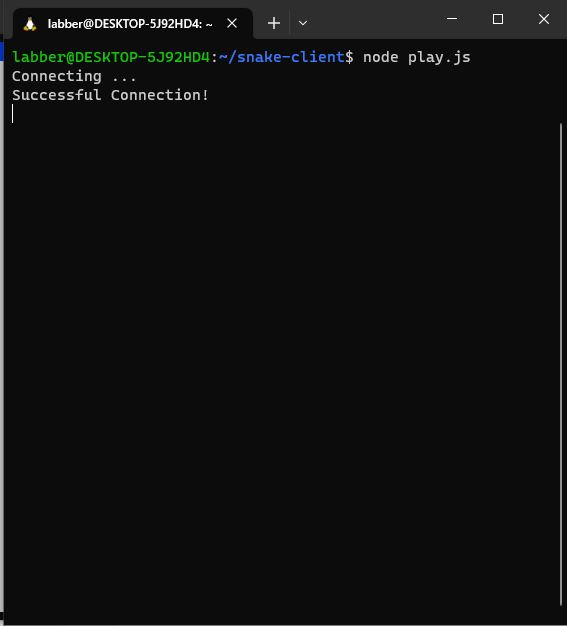
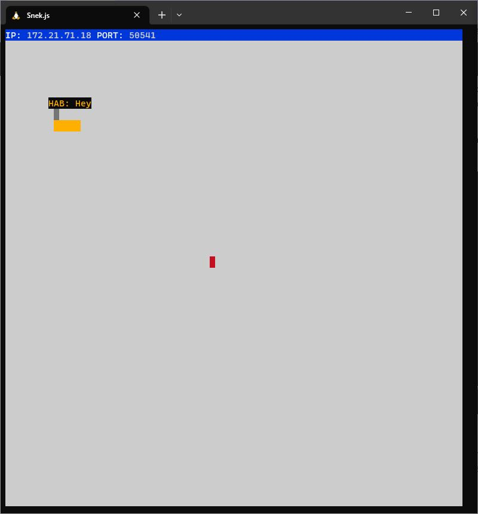

# Snake Client Project

Snake Client is a multiplayer version of the classic Snake game. In this game, players control a snake that grows in length by consuming pieces of food. The objective is to grow the snake as long as possible without colliding with the walls or the snake's own body, which leads to game over.

This project serves as the client-side of the Snake game. It connects to the Snake server, receives game data, and allows users to control their snake in real-time.

## Final Product

The screenshots above depict the graphical user interface of the Snake Client. The Linux Window showcases the terminal interface where the game is played, while the Snake Window displays the graphical representation of the game grid and the snake.

## Getting Started

To run the Snake Client, follow the steps below:

- Navigate to the `snake-client` directory in your terminal.
- Follow steps inside the snek server repo to run the server side.
- Run the development snake client using the `node play.js` command.
- Use `w,s,d,a` to move the snake around and try to grow the it by eating the fruit.
- Hitting the wall or the snake's body will end the game.
